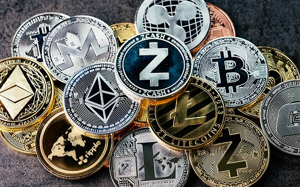

# Blockchain
Blockchain veya blokzinciri, bilgisayar terminolojisinde birbirine zincir halinde bağlı blokların tuttuğu ve sürekli büyüyen bir işlem kayıt defterini ifade eder.
Eşten eşe birbirine bağlı olan bu blokların işlem kayıtlarını sakladığı depoya ise dijital defter ismi verilmiştir.

Blokzincir yazılımı her türlü veriyi takip etmek için kullanılabilen dijital bir defterdir ve bu yazılım, diğer pek çok şeyin yanı sıra, mal akışını, para hareketlerini, sanat eserlerinin veya şiirlerin kime ait olduğunu takip edebilir. Sağlıktan nakliyeye spordan sanata, tasdik işlemlerinden oy kullanmaya kadar pek çok alanda blokzincir teknolojisi kullanılabilir.

Blokzincirler, bilgileri değişmez bir şekilde depolama yetenekleri ile ayırt edilir; yani bilgiler değiştirilemez veya hack’lenemez.

Her blokzincirin temel işlevi dijital bilgileri, “blok” adı verilen ve değiştirilemeyen koleksiyonlarda gruplandırmaktır. Bir blok veriyle dolduğunda, kalıcı bir kayıt haline gelebilmesi için, oldukça karmaşık bir işlem gerçekleştirilir. Her blok, her iki bloğun içeriğine başvuran bir kodla, bir sonraki bloğa bağlanır. Bu yüzden ona “zincir” denir.

Bilgisayarını kullanarak bir blokzincire katılan herkes, blokzincirde bir “düğüm” olarak kabul edilir. Bir zincirde binlerce, hatta milyonlarca düğüm olabilir. Tasarımın asıl başarısı, blokzincirin bu düğümlerin her biri ile çoğalması ve sürekli olarak güncellenmesidir.

Blokzincirler şeffaflığın yanı sıra yüksek derecede gizlilik sağlar. Blokzincir kullanan bir kişinin (veya makinenin) kimliği bir kod dizisinin arkasında gizlidir. Bu kişi kimliğini kendisi açıklamadıkça kim olduğu bilinemez. Ancak bu kimlik tarafından yapılan işlemler şeffaftır.

 Blockchain Nedir? 

Kaynakça: /\
https://www.btcturk.com/bilgi-platformu/blockchain-blokzinciri-teknolojisi-nedir/ \
https://www.paribu.com/blog/sozluk/blokzincir-nedir/ \
https://duzce.edu.tr/yonetim-bilisim-sistemleri/Sayfa/8C9A/blockchain-nedir-#:~:text=Bloklardan%20olu%C5%9Fan%20zincir%20yap%C4%B1daki%20Blockchain,bilgilerden%20her%20biri%20bir%20bloktur \

# Kripto Para

Bitcoin ve Ethereum en popüler <a href="https://coinmarketcap.com/"> Blockzincir Ağlarıdır </a>.  

Blokzincir teknolojisinin en bilinen ürünü ise, _kripto para_ birimleridir.

 Twitterdan Takip Edilebilecek Kişiler 

Tam liste: /\
https://twitter.com/professortrk?s=11 \
https://twitter.com/erhanunall?s=11 \
https://twitter.com/proftrader12?s=11 \
https://twitter.com/cryptotrader060?s=11 \
https://twitter.com/cryptoerge?s=11

 

  
